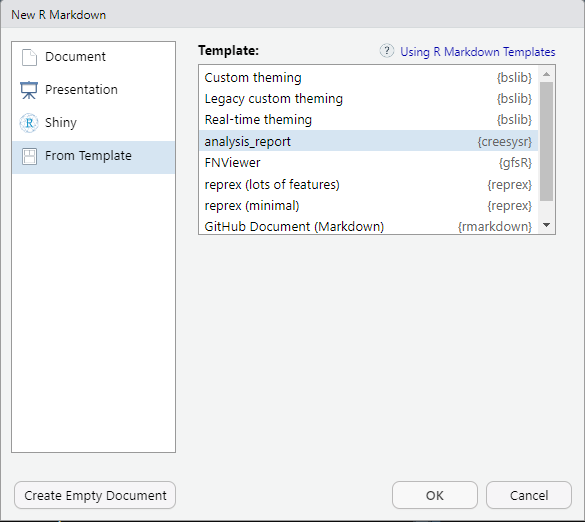
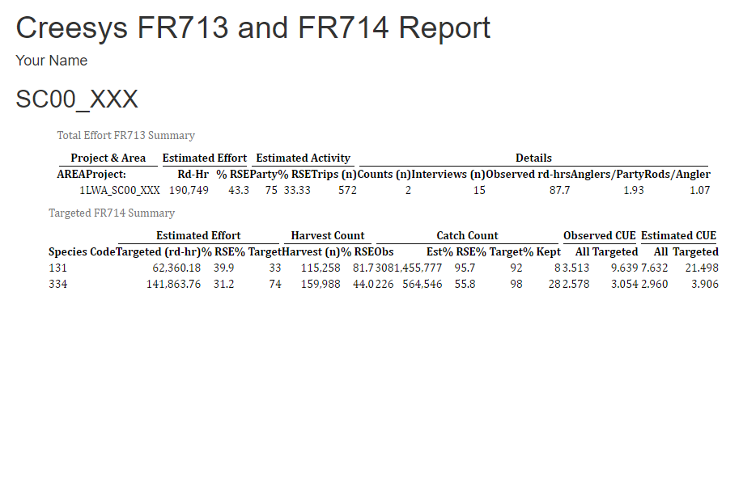

<!-- README.md is generated from README.Rmd. Please edit that file -->

```{r, include = FALSE}
knitr::opts_chunk$set(
  collapse = TRUE,
  comment = "#>",
  fig.path = "man/figures/README-",
  out.width = "100%"
)
```

# creesysr

<!-- badges: start -->
<!-- badges: end -->

Stay tuned. We're working on it!

## Contributors
Please view [CONTRIBUTING](CONTRIBUTING.md) for helpful context for package setup and repo specific instructions.

## Installation

You can install the development version of `creesysr` from the Github repository:

``` r
require(devtools)
install_github("https://github.com/FishNetMigration/creesysr")
```

## Example Code

Creel analysis using the example data included in the package:

```{r example1, eval=FALSE}
library(creesysr)
library(creesysr)
library(dplyr)
library(hms)
library(knitr)
library(kableExtra)
library(htmltools)
data("SC00")
names(SC00)
SC00$FN011
SC00_analysis <- generate_FR713_714_tables(SC00$FN011, SC00$FN022, SC00$FN023, SC00$FN024,
                                           SC00$FN025, SC00$FN026, SC00$FN028, SC00$FN111, 
                                           SC00$FN112, SC00$FN121, SC00$FN123)
```

It also possible to generate a report file from an Rmarkdown template:


The result will be an Rmarkdown report styled like the original FN2 output.

